# kottans-frontend
An Education From Kottans

- [x] 0 - <b>Git and GitHub</b> - [Done](#git-entry)
- [x] 1 - <b>Linux, Command Line, HTTP Tools</b> - [Done](#linux)
- [x] 2 - <b>Git for Team Collaboration</b> - [Done](#git-collaboration)
- [x] 3 - <b>Intro to HTML and CSS</b> - [Done](#html-css-intro)
- [x] 4 - <b>Responsive Web Design</b> - [Done](#responsive-design)
- [x] 5 - <b>HTML & CSS practice: Hooli-style Popup</b> - [Done](#html_css_practice)
- [x] 6 - <b>JavaScript Basics</b> - [Done](#JS_basics)


## <a name="git-entry">Git Recap</a>
I actively use git for not a long time and course from Udacity helped me a lot to figure out the things which were not very clear to me. For example, I've had troubles with merging and resolving conflicts. Also it was not clear for me, how git can manage different branches and commits. 
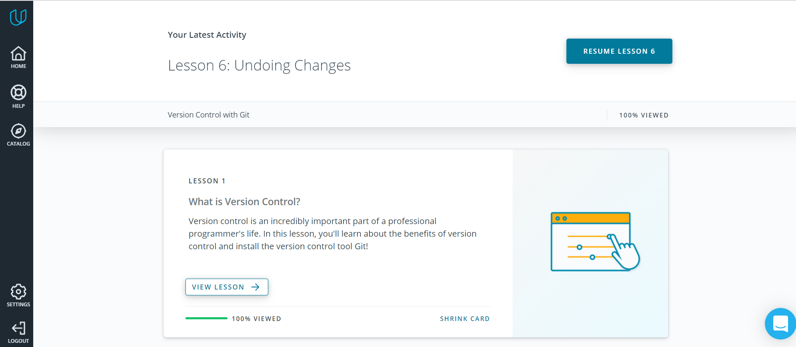
The main new points that I learned from this course.
 - Flags for `git log`:
 ```
    $ git log --oneline
    $ git log --stat
 ```
 - Command for working with branches `git branch` + commands to create, delete or switch the branch.
 - Command for merging and ways for resolving conflicts.
 - I didn't know that after reset the data is stored in 30 days.


 ## <a name="linux">Linux CLI, and HTTP</a>
 I am not an active Linux user, but have a little experience with it. This course got me better understanding of Linux file system and commands.
 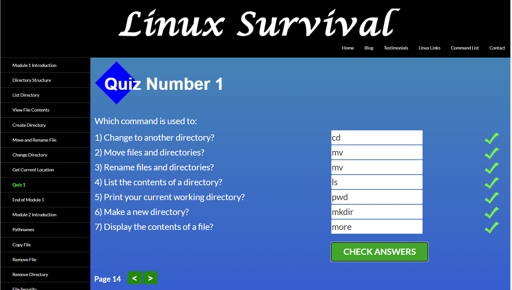
 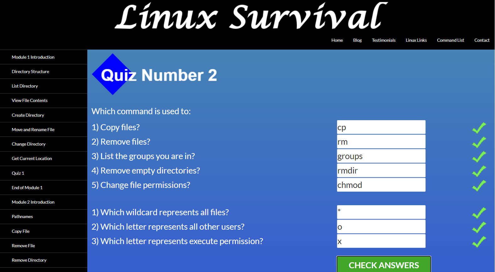
 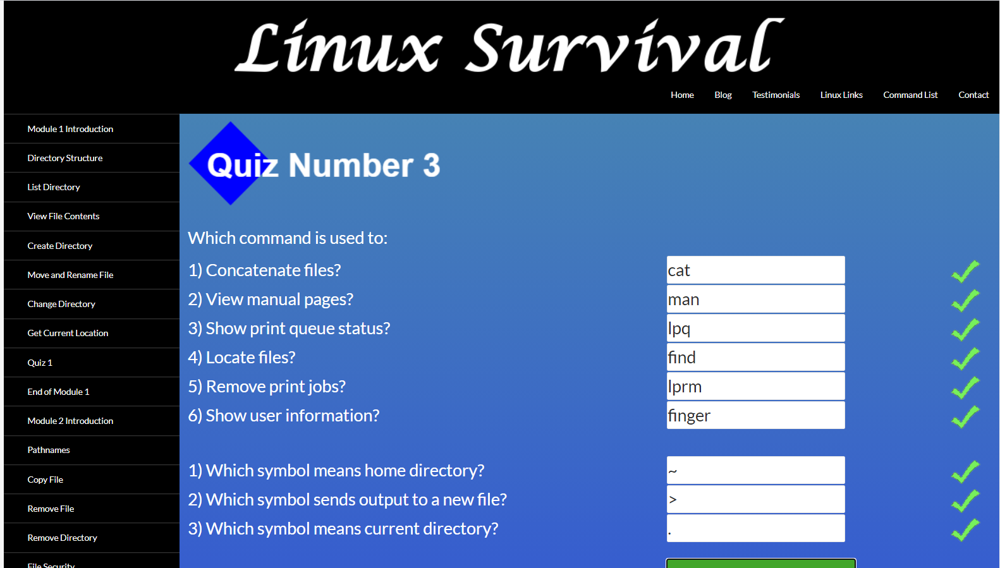
 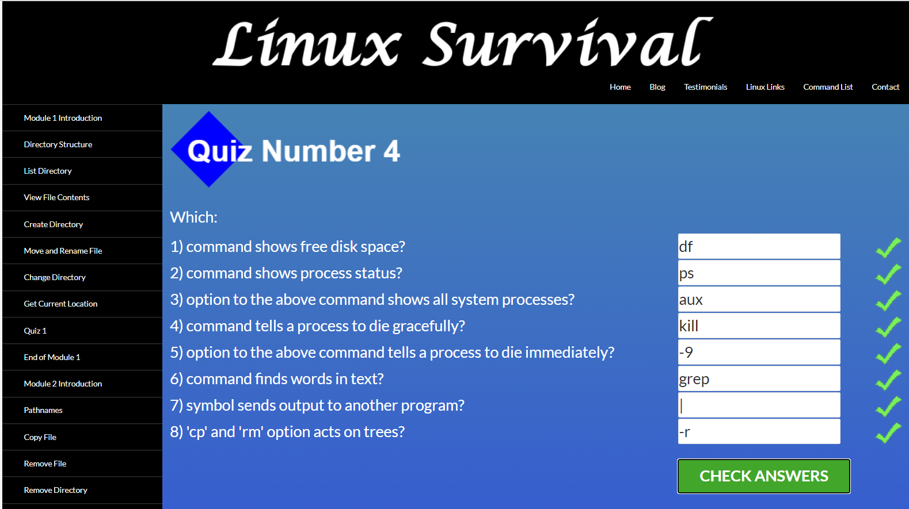
 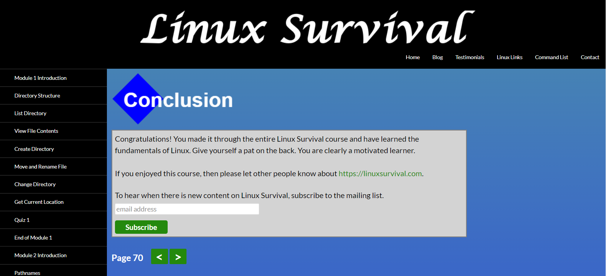
 In this section I've opened for myself a new Linux commands:
 - `lpr`, `lpq` and `lprm`: send document (or set of documents) for print.
 - flag `-r` to `cp` and `rmdir` for copy or remove directory with files and directories in.
 - `chmod` for add or remove permissions for user or group to read, write file or execute.
 - `ps aux` for watching current processes in the system, this is very usefull when you need to terminate some program and use command `kill`, for which you need to know the ID of the prosess (`ps aux` allows to find it).  
 - also I learned how to make a pipe output.

 From the articles about HTTP I've got:
 - what is HTTP and URL.
 - verbs (what exactly are GET, POST, PU, DELETE and OPTIONS, HEAD, TRACE).
 - the status-codes.
 - formats and information of requests and response messages.
 - which kind of connections may be between servers and clients.
 - importance of identification and authorization of users.
 - cashing abd it's settings.


## <a name="git-collaboration">Git Collaboration</a>
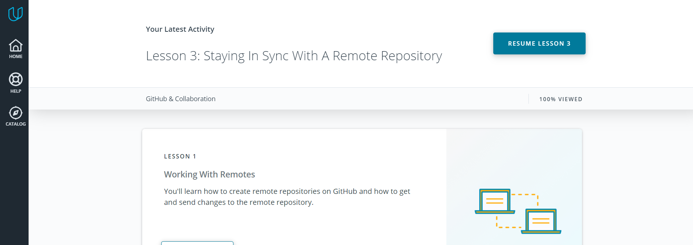
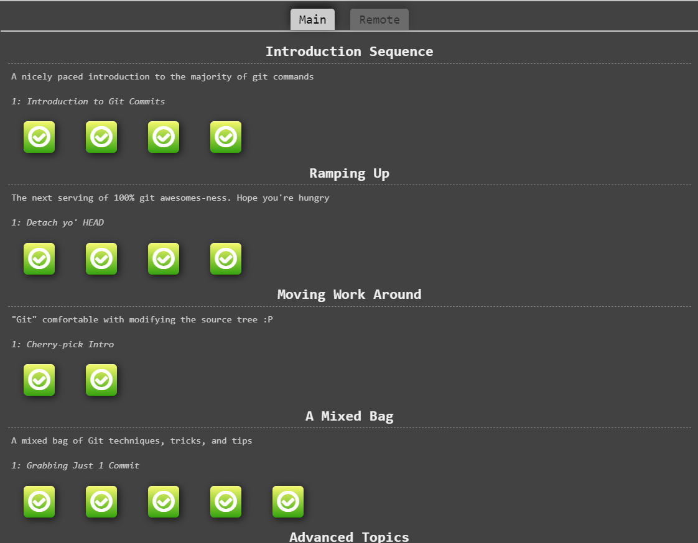

 I've never worked with remote repos in collaboration, so with these courses I've finally understood:
 - why do we need forks and how they work.
 - `git pull` and `git push` commands.
 - I've understood pull requests and how they work.
 - for me command `git rebase` was new.


## <a name="html-css-intro">Intro to HTML and CSS</a>
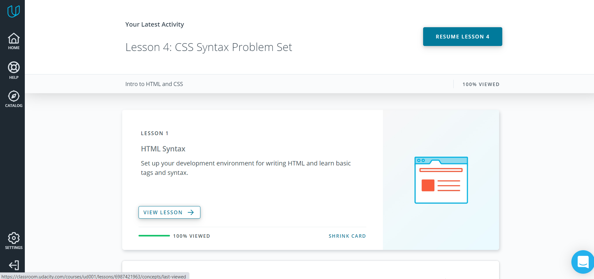
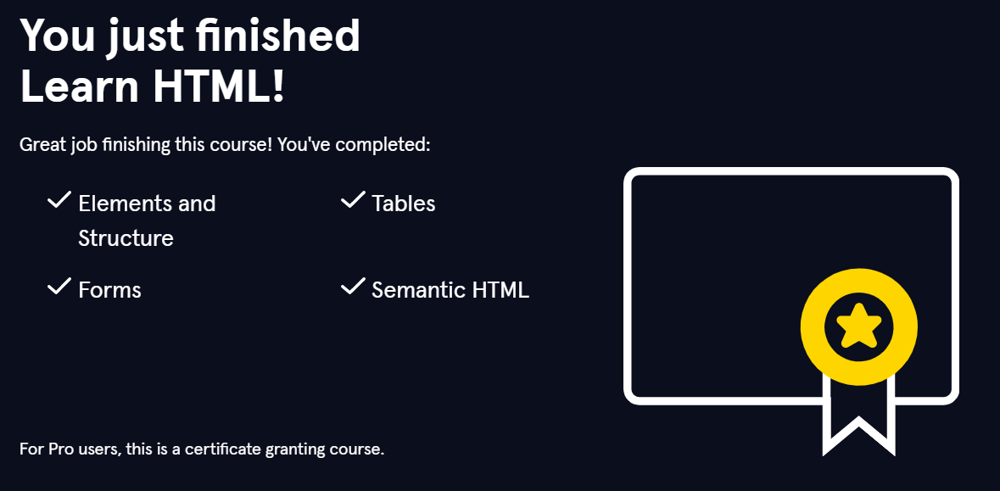
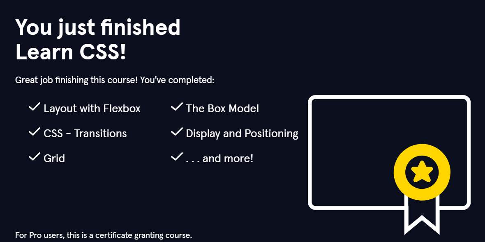

We cannot make front-end web-development without a knowledge of HTML and CSS. At this time I have already a little experience
in this area, but these courses gave me a little bit more insights.
Thus, courses from *Udacity* and *Learn HTML* gave me more understanding of forms,
I think, that the most useful for me was *Learn CSS* course. I have got more deep information about:
- box-model.
- flex-boxes.
- positioning.
Also I've never worked with *grids* and this course helped me to understand basics of grid layout.


## <a name="responsive-design">Responsive Web Design</a>
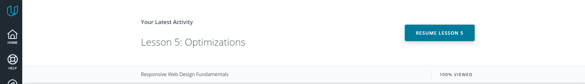
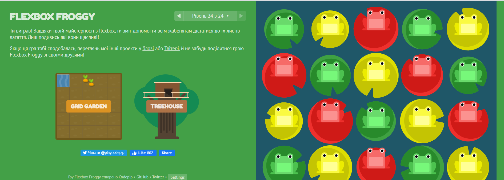

I think that "Froggy" is wonderful game-task for the best understanding haw to create layout with a flex-box. With this game
it is easy to see, how exactly each property of the flex-boxes and the flex-items work. "Grid Garden" is awesome for learning
grids.
"Responsive Web Design Fundamentals" from Udacity and extra-materials gave me better understanding of:
- how to choose the break-point of device width.
- what are responsive patterns and their differences.
- responsive tables, what is `data-th` attribute and how to use it.
- difference between physical pixels and DIP.
- how it is possible to override an `!important` statement in CSS.

## <a name="html_css_practice">HTML & CSS practice: Hooli-style Popup</a>
It was a interesting and challenging for me ) My main problem was how to put this popup menu (I'm used to use list for navigation).

[DEMO](https://ua-girl.github.io/Popup-practice/)


## <a name="JS_basics">JS Basics</a>

    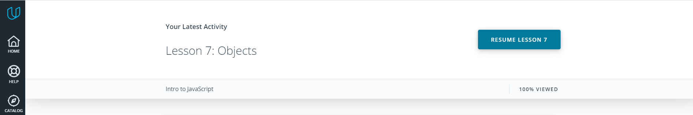

    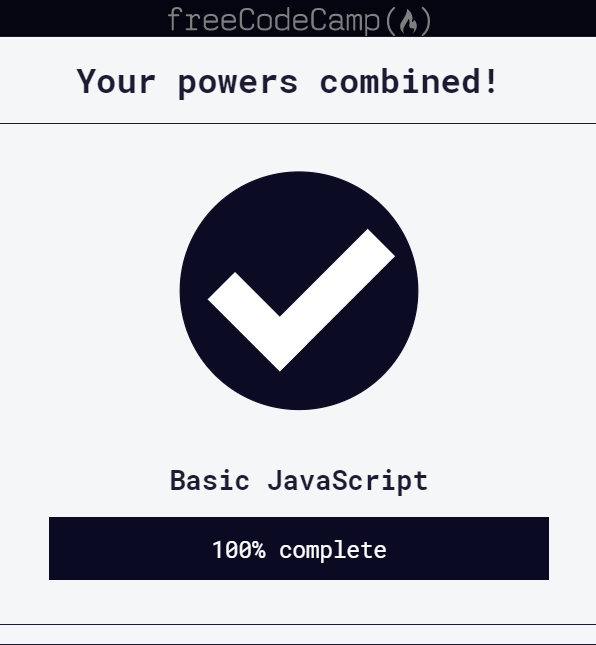

    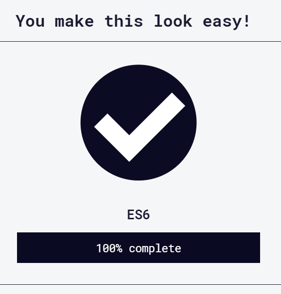

    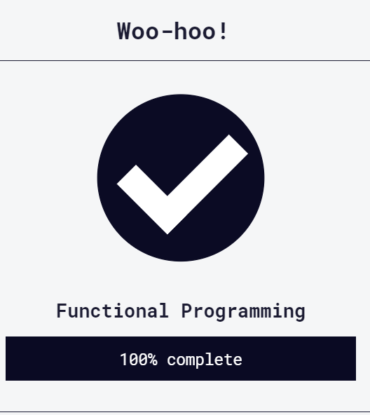

    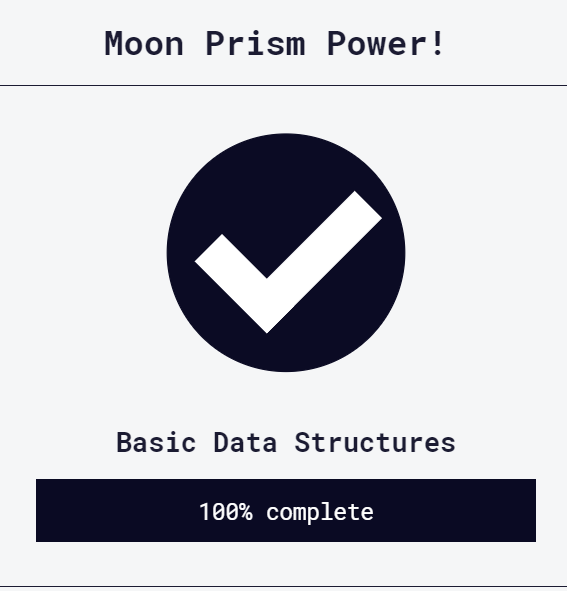

    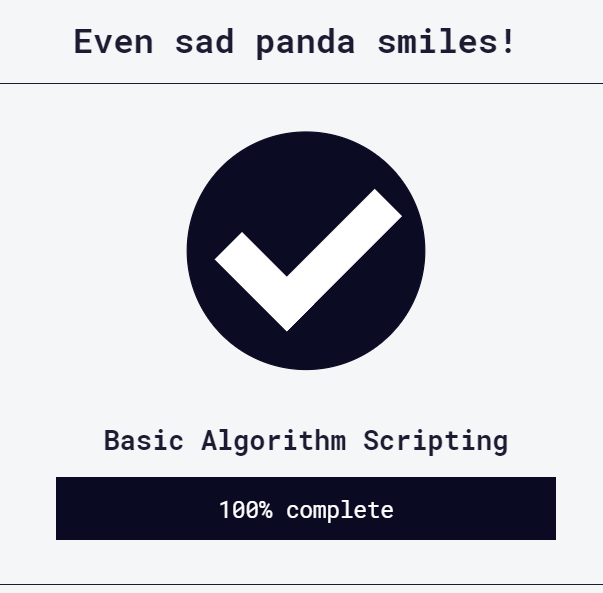

    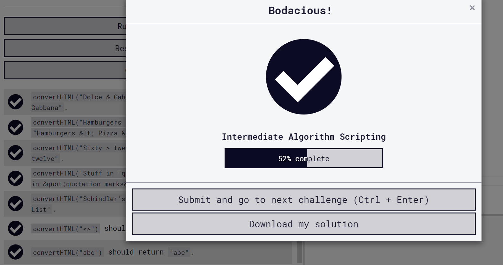

Earlier I had started a self-learning JavaScript with the other resources. My experience was not easy: it was hard for me to understand some
methods, for example, for me were hard to understand, how to use `Array.forEach()`, `Array.map()`, `Array.reduce()`, ets.
Courses, which I've just finished now, helped me to figure out haw to use all these methods )) And I can say, that these part was challenging for me.
For me next topics were very useful:

- what is spread operator and how to use it (for example, it is very helpful in searching for max and min value of an array (`Math.max(...[array])`).
- also I've understood why it is more preferable to use inside of the functions local variables, which allow not to change global variables (may
cause a bugs and problems).
- I've got more insights in difference between `let` and `var`. Earlier it was a little bit vague.

FreeCodeCamp tasks were not very hard at first, but some assignments from **"Basic Algorithm Scripting"**, **"Basic algorithms"** and
**"Algorithm Scripting Challenges"** were challenging and thus real exciting ))


