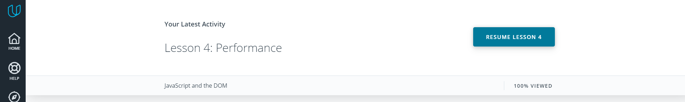
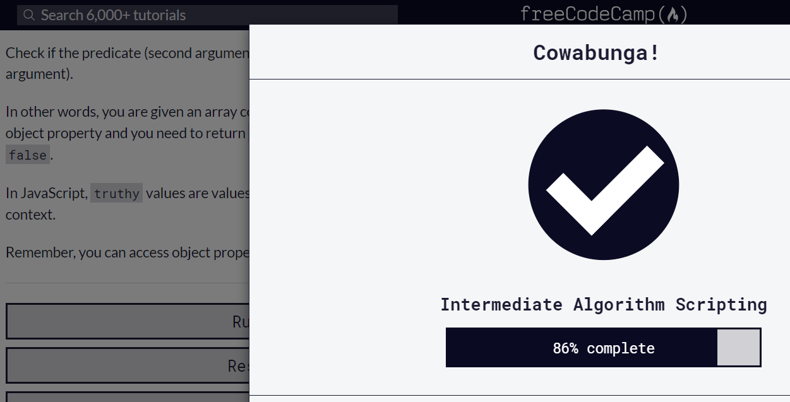
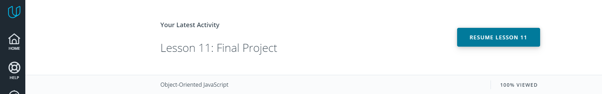
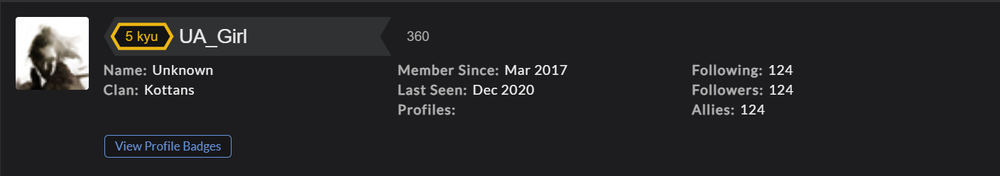
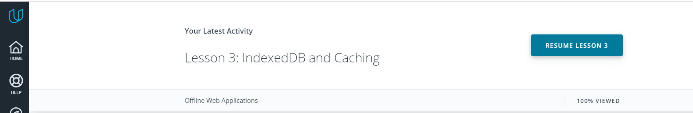

# kottans-frontend
An Education From Kottans

- [x] 0 - <b>Git and GitHub</b> - [Done](#git-entry)
- [x] 1 - <b>Linux, Command Line, HTTP Tools</b> - [Done](#linux)
- [x] 2 - <b>Git for Team Collaboration</b> - [Done](#git-collaboration)
- [x] 3 - <b>Intro to HTML and CSS</b> - [Done](#html-css-intro)
- [x] 4 - <b>Responsive Web Design</b> - [Done](#responsive-design)
- [x] 5 - <b>HTML & CSS practice: Hooli-style Popup</b> - [Done](#html_css_practice)
- [x] 6 - <b>JavaScript Basics</b> - [Done](#JS_basics)
- [x] 7 - <b>Document Object Model</b> - [Done](#DOM)
- [x] 8 - <b>Building a Tiny JS World</b> - [Done](#Pre-OOP)
- [x] 9 - <b>Object-Oriented JavaScript</b> - [Done](#OOP)
- [x] 10 - <b>OOP Exercise</b> - [Done](#OOP-Ex)
- [x] 11 - <b>Offline Web Applications</b> - [Done](#offline_web_app)
- [x] 13 - <b>Memory Pair Game</b> - [Done](#memory_pair_game)


## <a name="git-entry">Git Recap</a>
I actively use git for not a long time and course from Udacity helped me a lot to figure out the things which were not very clear to me. For example, I've had troubles with merging and resolving conflicts. Also it was not clear for me, how git can manage different branches and commits. 

The main new points that I learned from this course.
 - Flags for `git log`:
 ```
    $ git log --oneline
    $ git log --stat
 ```
 - Command for working with branches `git branch` + commands to create, delete or switch the branch.
 - Command for merging and ways for resolving conflicts.
 - I didn't know that after reset the data is stored in 30 days.


 ## <a name="linux">Linux CLI, and HTTP</a>
 I am not an active Linux user, but have a little experience with it. This course got me better understanding of Linux file system and commands.
 
 
 
 
 
 In this section I've opened for myself a new Linux commands:
 - `lpr`, `lpq` and `lprm`: send document (or set of documents) for print.
 - flag `-r` to `cp` and `rmdir` for copy or remove directory with files and directories in.
 - `chmod` for add or remove permissions for user or group to read, write file or execute.
 - `ps aux` for watching current processes in the system, this is very usefull when you need to terminate some program and use command `kill`, for which you need to know the ID of the prosess (`ps aux` allows to find it).  
 - also I learned how to make a pipe output.

 From the articles about HTTP I've got:
 - what is HTTP and URL.
 - verbs (what exactly are GET, POST, PU, DELETE and OPTIONS, HEAD, TRACE).
 - the status-codes.
 - formats and information of requests and response messages.
 - which kind of connections may be between servers and clients.
 - importance of identification and authorization of users.
 - cashing abd it's settings.


## <a name="git-collaboration">Git Collaboration</a>


 I've never worked with remote repos in collaboration, so with these courses I've finally understood:
 - why do we need forks and how they work.
 - `git pull` and `git push` commands.
 - I've understood pull requests and how they work.
 - for me command `git rebase` was new.


## <a name="html-css-intro">Intro to HTML and CSS</a>


We cannot make front-end web-development without a knowledge of HTML and CSS. At this time I have already a little experience
in this area, but these courses gave me a little bit more insights.
Thus, courses from *Udacity* and *Learn HTML* gave me more understanding of forms,
I think, that the most useful for me was *Learn CSS* course. I have got more deep information about:
- box-model.
- flex-boxes.
- positioning.
Also I've never worked with *grids* and this course helped me to understand basics of grid layout.


## <a name="responsive-design">Responsive Web Design</a>


I think that "Froggy" is wonderful game-task for the best understanding haw to create layout with a flex-box. With this game
it is easy to see, how exactly each property of the flex-boxes and the flex-items work. "Grid Garden" is awesome for learning
grids.
"Responsive Web Design Fundamentals" from Udacity and extra-materials gave me better understanding of:
- how to choose the break-point of device width.
- what are responsive patterns and their differences.
- responsive tables, what is `data-th` attribute and how to use it.
- difference between physical pixels and DIP.
- how it is possible to override an `!important` statement in CSS.

## <a name="html_css_practice">HTML & CSS practice: Hooli-style Popup</a>
It was a interesting and challenging for me ) My main problem was how to put this popup menu (I'm used to use list for navigation).

[DEMO](https://ua-girl.github.io/Popup-practice/)


## <a name="JS_basics">JS Basics</a>


Earlier I had started a self-learning JavaScript with the other resources. My experience was not easy: it was hard for me to understand some
methods, for example, for me were hard to understand, how to use `Array.forEach()`, `Array.map()`, `Array.reduce()`, ets.
Courses, which I've just finished now, helped me to figure out haw to use all these methods )) And I can say, that these part was challenging for me.
For me next topics were very useful:

- what is spread operator and how to use it (for example, it is very helpful in searching for max and min value of an array (`Math.max(...[array])`).
- also I've understood why it is more preferable to use inside of the functions local variables, which allow not to change global variables (may
cause a bugs and problems).
- I've got more insights in difference between `let` and `var`. Earlier it was a little bit vague.

FreeCodeCamp tasks were not very hard at first, but some assignments from **"Basic Algorithm Scripting"**, **"Basic algorithms"** and
**"Algorithm Scripting Challenges"** were challenging and thus real exciting ))


## <a name="DOM">Document Object Model</a>



I've never earlier tried to manipulate content of the page with JS, so this part was very new for me. The **Udacity course** gave me a
knowledge:
- how browsers parse HTML pages and what is DOM;
- how to create element on the page(`createElement()` method), add element to the page (`appendChild()` or `insertAdjacentHTML()`,
which are differ from each other by the place, where element will be inserted: at the end of parent element or at the certain position).
- also I've discovered, that `insertAdjacentHTML()` has 4 parameters of inserting: before a parent element or just after its opening tag
 (`beforebegin` and `afterbegin`) and before a parent's element closing tag or just after it (`beforeend` and `afterend`). It is important, that this method inserts
 a text, which later would be parsed as HTML.
- the difference between `firstChild` and `firstElementChild` - I'll be very careful with choosing one of these methods to get an appropriate result.
- two ways how to remove element from the DOM (with `<parent>.removeChild(<child>)` or just with simple `<element>.remove()`).
- I think I'll use `<element>.style.cssText` to set more than one style property at the time to the element.
- now I know, that if I have a container with few buttons (for example) and I need to add a same Event Listener to each button,
it is enough to add a single Event Listener to the parent container. It is great, because you don't need to have a bunch of listeners on the page
and in the same time you'll be abel to determine the element, in which the event was fired.


## <a name="Pre-OOP">Building a Tiny JS World</a>
I've made this task quickly, so waiting for the review and the next one!


## <a name="OOP">Object-Oriented JavaScript</a>




I am familiar with OOP approach, but in the Python. From the **Udacity course** I've discovered, that JS is rather functional language,
than object-oriented. What have I learned:
- all objects in JS in the core are functions. It is possible to add methods, which would be shared among all instances of
each particular object, by using prototype.
- keyword `this` allows to bind methods and attribute of an object (class) to each of its instances. Thus, every instance will get it's own "this".
- to create an instance of some object and get access via the instance to all methods and attributes of an object, we can use `new` keyword.
This will bind `this` to the instance which was just created (not the global): created instance will get a link to the <Object>.prototype.
- if we use `new` when new instance of an object created, we call also a `constructor` method, which creates an object, which is assigned to
our instance.
- `<Object>.prototype.<method> = function()` adds a method `method` to the <Object>, thus each instance of the `<Object>`, created
with `new` keyword, will get access to this method.

This part was a little bit confusing for me, but the practical part helped me to get a better understanding of Objects in JS. I know,
that I will read more about OOP in JS for deeper understanding it's concepts.


## <a name="OOP">OOP Ex</a>

It was interesting to rewrite own code )


## <a name="offline_web_app">Offline Web Applications</a>


This topic was brand new for me. Well, I've heard about off-line users' experience, but never got deep in this topic. Now I know, that there are
some methods, which can improve users' experience with apps and sites in low network conditions or even in its absence.

- service worker (SW) is a "layer" between server and user. This is JavaScript code, which works separately and doesn't has an access to the pages's dom.
- SW allows user to load site or an app from cache (so, with a low connection user will get not an empty page, but some cashed content).
- SW has its life cycle:
    - installation: here need to add an EventListener `install`, and add file for storing a cache and list of files, which should be cashed,
    - activation,
    - fetching requests: here user either will get requested data from a cache, or (if the cache does not contain requested resource)
    request will be sent on server, then response will be cached and sent back to user.
- to add SW on the pag one needs to register it on the page when window loads with Promise.

It is very brief recap, and I know, that I will pass again this course and articles step by step for better understanding.


## <a name="memory_pair_game">Memory Pair Game</a>

It was very interesting project. I've got a new experience and a new game for my son )))))))
